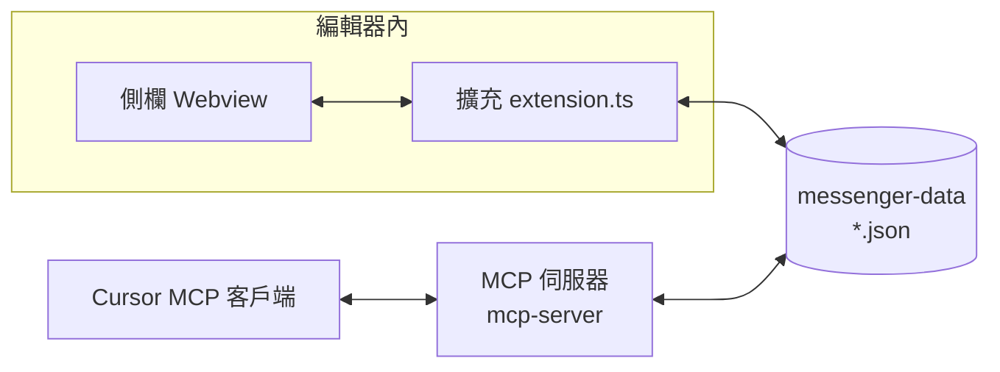
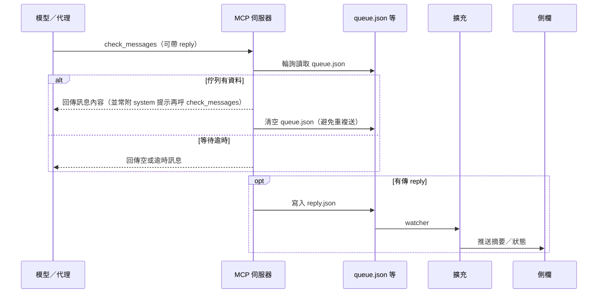
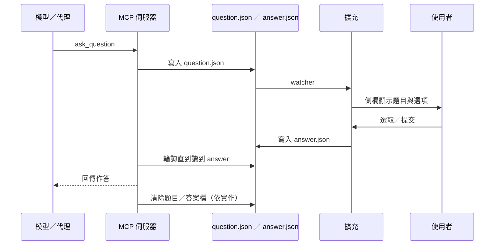

# 專案運作說明

本文件說明 **mcp-cursor-message** 從啟動到一則訊息往返的**實際流程**：誰寫檔、誰讀檔、MCP 與側欄如何接力。安裝與命令列表見 [README.md](./README.md)；給 AI 代理的慣例見 [AGENTS.md](./AGENTS.md)。

---

## 整體在做什麼

系統裡有**兩個程式**：**VS Code／Cursor 擴充**（含側欄 Webview）與 **MCP 伺服器**（Cursor 以子程序啟動、走 stdio）。它們**不直接連線**，只透過同一個資料夾 **`MESSENGER_DATA_DIR`** 底下的 **JSON 檔**交換狀態。  
側欄負責「給人看、給人點」；MCP 負責「給模型用的工具：`check_messages`、`ask_question`、`send_progress`」。

---

## 流程 0：安裝後發生什麼

1. 使用者用資料夾開工作區，必要時執行命令 **`mcp-cursor-message: Install MCP configuration`**：`mcp-config.ts` 會在 `.cursor/mcp.json` 寫入一條 MCP 條目，並把 **`MESSENGER_DATA_DIR`** 設成與擴充一致的路徑（有工作區時通常是 `<工作區>/.cursor/messenger-data`）。
2. 重啟 Cursor 後，MCP 子程序帶著這個環境變數啟動，`mcp-server/index.ts` 讀寫的檔案就會和擴充相同。
3. 擴充啟用時會註冊側欄 Webview、監聽上述目錄的 `*.json` 變化；檔案一改就**防抖**後把最新佇列／問答／摘要推到 Webview。

---

## 流程 1：使用者內容進佇列

1. 使用者在側欄輸入文字、貼圖、或用命令把檔案路徑送進佇列。
2. 擴充把內容**附加**進 `queue.json`（格式見 `src/types/ipc-json.d.ts`），並可能帶上時間戳。
3. File watcher 觸發 → 側欄刷新預覽；此時 MCP 尚未一定要被呼叫，但**佇列已落在磁碟上，等待模型端處理**。

---

## 流程 2：`check_messages` —— 把佇列餵進對話

典型是：**模型或代理在某一輪呼叫** `check_messages`。

重點：

- **拉佇列**：MCP 從 `queue.json` 讀出內容、轉成可進模型的片段；成功consume 後會**清空**佇列。
- **`reply` 參數**：可選。寫進 **`reply.json`**，擴充讀取後顯示在側欄（本輪摘要）。
- 回傳文字末尾常有 **system suffix**，提醒代理「這輪還沒完、下一輪再呼 `check_messages`」——與你們在 Cursor 裡設定的對話規則一致。

---

## 流程 3：`ask_question` —— 側欄答題再回傳模型

當模型需要**單選／多選／固定選項**時：

也就是：**題目從 MCP 進磁碟 → UI 從磁碟長出來 → 答案從 UI 寫回磁碟 → MCP 撿起來回給模型**。

---

## 流程 4：`send_progress`

長任務時模型可呼叫 **`send_progress`**：把一段 Markdown 進度寫進與摘要相同路徑的機制（**`reply.json`** 語意），**不阻斷**、不等使用者。側欄一樣經 watcher 更新，讓使用者看到「進行到哪」。

---

## 建議使用模式（給模型／代理）

- **多步驟任務 → 預設用 `send_progress` 回報**
  - 當你判斷本輪任務會分成兩個以上的步驟（例如「先找問題 → 再修正 → 再跑測試」），請在每個**關鍵步驟完成後**呼叫一次 `send_progress`。
  - 建議在 `progress` 文字裡包含：
    - 已完成的項目（Done）
    - 目前狀態與仍未完成的部分（Current / TODO）
    - 下一步預計要做什麼（Next）
- **需求或選項不清楚 → 優先用 `ask_question`**
  - 當你對使用者的指令有兩種以上合理解讀、或需要使用者在幾個策略之間做選擇時，請**不要自行假設**，改用 `ask_question`。
  - 每題問題建議：
    - 問句簡短清楚
    - 提供 2–4 個選項（描述具體行為或偏好）
    - 視需要允許多選

上述建議與實際工具行為以 `mcp-server/index.ts` 內的 `SYSTEM_SUFFIX` 描述為準；若有調整，請同步更新本段說明。

---

## 資料夾裡的檔案（速查）

| 檔案 | 在流程中的角色 |
|------|----------------|
| `queue.json` | 使用者／擴充寫入待處理訊息；`check_messages` 讀取後清空 |
| `question.json` | `ask_question` 寫入；側欄渲染 |
| `answer.json` | 使用者提交後擴充寫入；MCP 讀取 |
| `reply.json` | `check_messages` 的 `reply` 或 `send_progress` 的內容；側欄展示 |
| `history.json` | 側欄對話歷史（擴充讀寫；與 MCP 佇列格式無關） |
| `server.log` | MCP 除錯用（可選）；超過約 **1 MiB** 時自尾端截斷 |

路徑必須對齊：**沒設好 `MESSENGER_DATA_DIR`，MCP 會用到程式內建 fallback 目錄，與擴充分離**，側欄和模型就會「各說各話」。

---

## 程式放哪裡（對照流程）

| 你想找的行為 | 大概從這裡讀 |
|--------------|----------------|
| 側欄 UI、提交答案、postMessage | `src/webview/main.ts` |
| Webview 註冊、推狀態、watcher、命令 | `src/extension.ts` |
| 擴充 → 側欄 `state`（含 `history` 與 `history.json`） | `pushStateToPanel`（`src/extension.ts`）、`ExtensionPanelStateMessage`（`src/types/panel-messages.d.ts`） |
| 讀寫 `queue.json` 等 | `src/ipc.ts`、`src/types/ipc-json.d.ts` |
| 寫 `.cursor/mcp.json` | `src/mcp-config.ts` |
| MCP 工具與輪詢邏輯 | `mcp-server/index.ts` |
| 三份 bundle 怎麼編 | `esbuild.config.mjs` |

---

## 建置與發佈（精簡）

- 開發：`bun run compile` 產出 `dist/mcp-server.mjs`、`dist/extension.js`、`dist/webview.js`。
- 安裝包：`bun run package` 產出根目錄 `.vsix`。
- CI：推送或發 GitHub Release 時， [`.github/workflows/package.yml`](./.github/workflows/package.yml) 可自動打包並附上 VSIX。

---

## 注意事項（運維角度）

- **Webview**：內容需防 XSS；路徑與檔名是信任邊界外可讀寫的介面。
- **命名**：MCP 在設定檔裡的鍵名與 `mcp-server` 內常數應保持同步（見 `mcp-config` 與 `MCP_DISPLAY_NAME`）。

若本文與程式行為不一致，**以程式碼為準**，並請把差異補回本文件。
